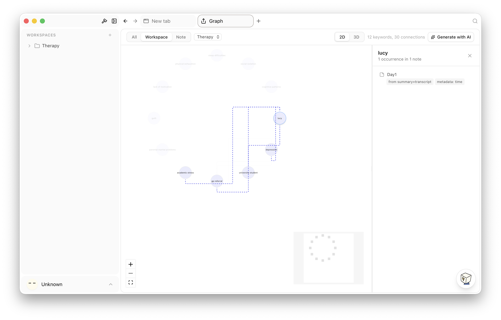
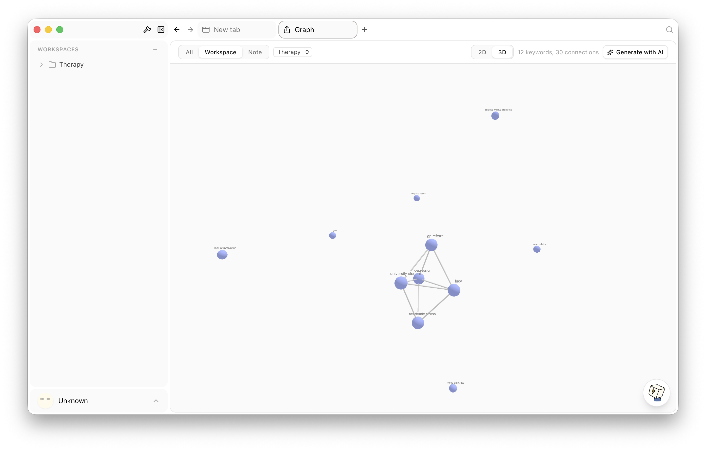

# Open Mushi

A desktop meeting companion that captures system audio and microphone input, transcribes locally via [sherpa-onnx](https://github.com/k2-fsa/sherpa-onnx), processes transcripts through an LLM-powered skill system, and visualizes keyword connections via a knowledge graph.

Built with [Tauri v2](https://tauri.app/) (Rust) + React 19 (TypeScript).





## Features

- **Local Speech-to-Text** — On-device transcription using sherpa-onnx (Whisper models) with Silero VAD and speaker diarization
- **Audio Capture** — System audio + microphone input via cpal/CoreAudio
- **LLM Integration** — Frontend-driven AI via AI SDK (OpenRouter, Ollama, LM Studio, OpenAI, etc.)
- **Skill Engine** — SKILL.md files with YAML frontmatter, parsed by Rust and rendered via minijinja
- **Knowledge Graph** — Visualize keyword connections from transcripts (React Flow)
- **AI Chat** — Context-aware chat panel powered by configurable LLM providers
- **Full-Text Search** — Tantivy-based indexing and search
- **Privacy First** — All processing runs locally, no cloud dependencies required

## Tech Stack

| Layer | Technology |
|-------|-----------|
| Desktop framework | Tauri v2 |
| Backend | Rust 1.93 |
| Frontend | React 19, TypeScript, Vite |
| Styling | Tailwind CSS v4, shadcn/ui (new-york) |
| Routing | TanStack Router (file-based) |
| State | Zustand (ephemeral) + TinyBase (persisted) |
| Database | libSQL / SQLite |
| STT | sherpa-onnx via sherpa-rs |
| Actor system | Ractor |

## Project Structure

```sh
apps/desktop/         # Tauri desktop application
  src-tauri/          # Rust backend entry point
  src/                # React frontend
    routes/           # TanStack Router file-based routes
    session/          # Session/meeting view
    transcript/       # Transcript pipeline + UI
    chat/             # AI chat panel
    graph/            # Knowledge graph (React Flow)
    settings/         # Settings panels
    sidebar/          # Timeline, session list
    store/            # Zustand + TinyBase stores

crates/               # Rust library crates
  audio/              # Audio capture and processing
  stt-sherpa/         # sherpa-onnx STT engine
  listener-core/      # Audio listener actor pipeline
  vad/                # Voice activity detection
  db-core/            # Database core
  frontmatter/        # SKILL.md frontmatter parser
  llm-*/              # LLM integration crates
  ...                 # 60+ internal crates

plugins/              # Tauri plugins
  listener/           # Audio listener plugin
  local-stt/          # Local STT plugin
  local-llm/          # Local LLM plugin
  settings/           # Settings plugin
  permissions/        # Permissions plugin
  ...                 # 30+ plugins

packages/             # Shared TypeScript packages
  ui/                 # shadcn/ui component library
  tiptap/             # Tiptap editor extensions
  tinybase-utils/     # TinyBase helpers
  store/              # Shared store utilities
  utils/              # Common utilities
```

## Prerequisites

- **Node.js** >= 22
- **pnpm** 10.30.0
- **Rust** 1.93 (via `rust-toolchain.toml`)
- **macOS** (primary target — uses CoreAudio, macOS accessibility APIs)
- Xcode Command Line Tools

## Getting Started

### Setup

```bash
pnpm install
```

### Development (desktop)

```bash
# Build shared UI package first when desktop CSS/assets are needed
pnpm -F @openmushi/ui build

# Preferred (workspace/turbo, from repo root)
pnpm turbo tauri:dev --filter=@openmushi/desktop

# Alternative (inside apps/desktop)
pnpm tauri:dev
```

### Production build (desktop)

```bash
# Full workspace build
pnpm turbo build

# Preferred desktop bundle build from repo root
pnpm turbo tauri:build --filter=@openmushi/desktop

# Alternative (inside apps/desktop)
pnpm tauri:build
```

### Quality checks

```bash
pnpm turbo typecheck
pnpm lint
pnpm fmt
```

### Tests

```bash
# Desktop tests
pnpm -F @openmushi/desktop test

# Single Vitest file
pnpm -F @openmushi/desktop test -- src/session/components/note-input/note-tab.test.tsx

# Rust workspace tests
cargo test --workspace

# Single Rust crate / single Rust test name
cargo test -p listener-core
cargo test -p listener-core <test_name>
```

## STT Models

Open Mushi downloads STT models on first use:

| Model | Size | Description |
|-------|------|-------------|
| Whisper Tiny | ~75 MB | Fastest, lower accuracy |
| Whisper Base | ~142 MB | Balanced |
| Whisper Small | ~244 MB | Default, best accuracy |
| Silero VAD | ~2 MB | Voice activity detection |
| NeMo SpeakerNet | ~21 MB | Speaker identification |

## Design Documents

Detailed design and implementation plans are in `docs/plans/`:

- Full system design
- 11 phased implementation plans (Phase 0-10)
- STT integration design
- Knowledge graph architecture
- 2026-03-11 StenoAI-inspired recording integration plan

## License

See [LICENSE](LICENSE) for details.
